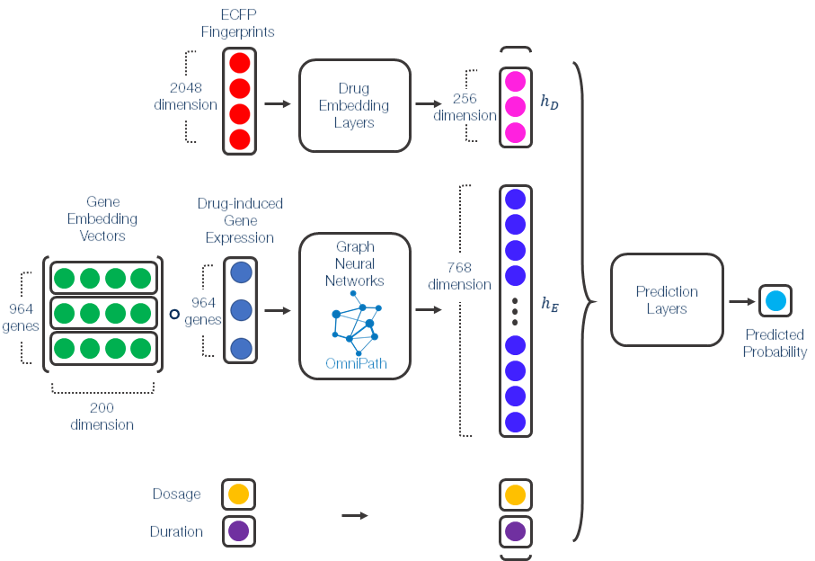
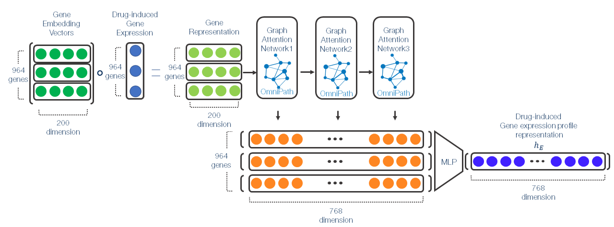

# GLIT: A Graph Neural Network for Drug-induced Liver Injury Prediction using Transcriptome Data

- Overview & GNN achitecture of GLIT
<p align='center'></p>
<p align="center">
  <b> Overall architecture of GLIT </b>
</p>

<p align='center'></p>
<p align="center">
  <b> Graph neural network architecture of GLIT </b>
</p>

Required modules are:

```
python==3.6
torch==1.0.1
torch-scatter==1.1.2
torch-sparse==0.2.4
torch-cluster==1.2.4
torch-geometric==1.1.2
networkx==2.3
rdkit
```

1. Download required data/models from https://drive.google.com/drive/folders/1_NLeSBIdQO2Gbh6n97is5tKfUi_zSsH5?usp=sharing

2. run 'run_main4.sh'
